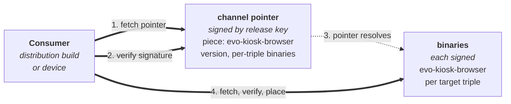

# evo-kiosk-artefacts

> The release plane for [evo-kiosk](https://github.com/foonerd/evo-kiosk). Signed, cross-compiled on-device kiosk session artefacts, fetched by any distribution that ships the evo kiosk shell.

Manifest in. Signed bytes out. Consumers pick the channel.

This repository is the device-facing (and distribution-facing) surface of the on-device kiosk session shell. Editing source code in [evo-kiosk](https://github.com/foonerd/evo-kiosk) (release-only) or [evo-kiosk-eng](https://github.com/foonerd/evo-kiosk-eng) (private engineering) does not touch these assets. What lands here is exactly what a distribution (or a device tracking directly) fetches and verifies.

## What lives here



Empty today. The publish pipeline waits on the eng-side release-cut path landing (`scripts/release/pre-tag-check.sh` and `scripts/release/promote.sh` are shipped on `evo-kiosk-eng` main; cross-compile pipeline is the next step). First content arrives when the eng-side first cut promotes.

## Layout

```text
channels/               signed channel pointers (dev / test / prod)
    dev.toml            per-piece version pointer
    dev.sig             detached signature over dev.toml

binaries/               cross-compiled release binaries
    aarch64-unknown-linux-gnu/
        evo-kiosk-browser
    x86_64-unknown-linux-gnu/
        evo-kiosk-browser
    armv7-unknown-linux-gnueabihf/
        evo-kiosk-browser

LICENSE                 Apache-2.0
README.md               this file
```

The kiosk release plane publishes a single piece — the WebKit session-shell binary `evo-kiosk-browser` — across every supported target triple. Distributions that ship the kiosk unit (`evo-kiosk.service`, `labwc` config, session scripts) source those non-binary assets from [evo-kiosk](https://github.com/foonerd/evo-kiosk) directly; only the pre-built binary is republished here so a distribution does not need to carry a Rust toolchain plus GTK4 + webkit2gtk build headers to install the kiosk shell on-device.

## Channels

Three named tracks of release readiness: `dev`, `test`, `prod`. Same shape as every other release plane in the evo ecosystem.

- **A channel is a pointer, not a bucket.** A version of the binary is built once, signed once, stored once. Promotion from `dev` to `test` is a pointer edit — the channel's pointer now names that version. The bytes do not change; the signature does not change. Bit-identical artefacts across every channel they appear on.
- **Selection is per-consumer.** A consumer's channel map says: which channel do you track for the kiosk binary? A developer iterating on the shell can track `dev`; a production device tracks `prod`.
- **Rollback is a pointer move.** Re-promote a prior version to the same channel. No rebuild. No re-signing.

## Consuming artefacts

Two consumer profiles:

- **Distributions** that ship the evo kiosk shell (`evo-device-audio` and other `evo-device-<vendor>` repositories) reference this release plane by channel. The distribution's build process fetches the pointer, resolves it to a binary at the target triple, verifies the signature, and places the binary under `/usr/local/bin/evo-kiosk-browser` alongside the session scripts and unit file that source from [evo-kiosk](https://github.com/foonerd/evo-kiosk).
- **Devices** whose fetch tooling is wired to multiple release planes may pull the kiosk binary directly at install / update time.

Either way: the consumer verifies the channel pointer's signature against the release public key, then verifies the binary's signature before placing it. `scripts/install/install.sh` in [evo-kiosk](https://github.com/foonerd/evo-kiosk) will consume this pipeline once the eng-side cross-build path lands.

## Publishing artefacts

The [evo-kiosk-eng](https://github.com/foonerd/evo-kiosk-eng) private engineering repo owns the release cut. Two release surfaces there drive this plane:

- `scripts/release/pre-tag-check.sh` — seven-gate pre-tag verification (fmt, clippy, tests, SPDX, leak scan, shellcheck, privileges TOML + workspace build). Runs before tag mint.
- `scripts/release/promote.sh` — eng → public squash-and-scrub cut. Applies to the public [evo-kiosk](https://github.com/foonerd/evo-kiosk) source repo; a follow-on publish step (to land) cross-compiles the release binary and writes to this repository.

The cross-compile step targets `aarch64-unknown-linux-gnu`, `x86_64-unknown-linux-gnu`, and `armv7-unknown-linux-gnueabihf` at minimum, matching the evo framework's supported architectures.

## Signing and trust

The evo project signs the channel pointer and each binary with the release signing key. Consumers refuse an unsigned or invalidly-signed pointer or binary. The public key half + sidecar metadata live in the peer release planes (see [foonerd/evo-core-artefacts](https://github.com/foonerd/evo-core-artefacts)) and are consumed by every device that admits evo signed artefacts.

Distributions that ship the kiosk shell bundle the trust root by default. Operators retain final say per the framework's operator-sovereignty position.

## Status

Empty. Populated when the eng-side cross-build + publish path lands.

## Related

- [foonerd/evo-kiosk](https://github.com/foonerd/evo-kiosk) — public release-only source repository this release plane serves.
- [foonerd/evo-core](https://github.com/foonerd/evo-core) — the framework.
- [foonerd/evo-core-artefacts](https://github.com/foonerd/evo-core-artefacts) — the framework's release plane; consumers verify against the same trust root.
- [foonerd/evo-device-audio](https://github.com/foonerd/evo-device-audio) — first distribution to consume the kiosk release plane.

## License

Apache 2.0. See [LICENSE](LICENSE).
